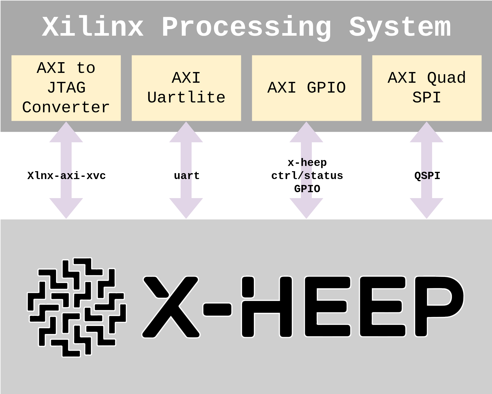

# x-heep Xilinx SoCs Interface

**Xilinx SoCs on-board support for [x-heep](https://github.com/x-heep/x-heep).**

---

<p align="center">
   
</p>

This repository provides the software interface and drivers required to integrate the [x-heep](https://github.com/x-heep/x-heep) RISC-V system with the Processing System (PS) of Xilinx SoCs. 

Acting as a bridge between the Xilinx ARM-based Processing System and the FPGA Programmable Logic (PL) hosting x-heep, this framework enables a fully remote development. 
Users can deploy, test, and debug the core via SSH, entirely eliminating the need for physical access to on-board JTAG or UART headers.

### Key Features

* **Remote Deployment via SSH:** Manage the entire development cycle (programming, execution, and monitoring) over a network connection.
* **Remote Bitstream Loading:** Deploy x-heep hardware designs directly from Python using [PYNQ](https://github.com/Xilinx/PYNQ)-based drivers.
* **OpenOCD & XVC Integration:** Leverages OpenOCD 0.12.0 and the Xilinx Virtual Cable (XVC) protocol to load `.elf` firmware over AXI JTAG.
* **Dynamic UART Overlay:** Automatically patches, compiles, and loads a Linux Device Tree Overlay (DTO) to expose the AXI UART as a system device.
* **Dynamic SPI Overlay:** Automatically manages the AXI Quad SPI device tree overlay to expose the SPI bus for flash programming.
* **Direct Flash Programming:** Programs external SPI NOR flash via direct MMIO access, without requiring kernel SPI drivers.
* **Execution Control:** Full remote control over the core lifecycle, including reset, boot mode selection, and exit status monitoring via GPIO.
* **Bitstream Change Detection:** SHA256-based tracking avoids unnecessary PL resets when the same bitstream is reused.

---

## Supported Platforms

| Board    | SoC                | Status    | Notes                                                      |
| -------- | ------------------ | --------- | ---------------------------------------------------------- |
| PYNQ-Z2  | Zynq-7000 (XC7Z020)| Supported | Requires `PS_ENABLE` to be active in the x-heep bitstream. |
| AUP-ZU3  | ZynqMP (XCZU3EG)   | Supported | Requires `PS_ENABLE` to be active in the x-heep bitstream. |

> **Important:** Ensure that the Vivado version used to implement x-heep is consistent with the PYNQ distribution installed on the board. 
>                Mismatched versions may cause issues with JTAG TAP identification and bitstream loading.

---

## Installation

The installation process is fully automated through a single command.
This script installs system dependencies, builds OpenOCD with specific patches, and configures the Python environment.

```bash
make install
```

> **Note:** To work directly in the configured root environment, run `sudo -i`.
>          The shell is configured to automatically source the PYNQ virtual environment and place you in `/home/xilinx`.

> **Warning:** `make install` performs large downloads and compilation (cloning and building OpenOCD, etc.). 
>              Depending on your network and CPU it can take a long time.
>              It's recommended to run `make install` inside a `tmux` session so the long-running process continues if your SSH session disconnects.

### OpenOCD Build and Patch

During installation, the script automatically:

1. **Clones OpenOCD** from the official repository at version v0.12.0.
2. **Applies a Custom Patch** (`patch/openocd.patch`) required for correct operation with the x-heep RISC-V core:
   * Disables `vlenb` register probing unless the vector extension (V) is present in MISA.
   * Disables `MTOPI`/`MTOPEI` privileged interrupt register probing.
   * Replaces hard assertions with warnings for graceful degradation.
3. **Builds OpenOCD** with the following features enabled:
   * FTDI interface support (`--enable-ftdi`)
   * Bitbang driver support (`--enable-bitbang`)
   * Xilinx AXI XVC support (`--enable-xlnx-axi-xvc`)
   * Internal JimTcl interpreter (`--enable-internal-jimtcl`)
4. **Installs OpenOCD** system-wide at `/usr/local/bin/openocd`.

### Jupyter Notebook Installation

To install the Jupyter notebook interface to the board's default notebook directory:

```bash
make install-notebook
```

This copies all necessary files (notebook, drivers, config, DTS templates) to `~/jupyter_notebooks/xheep`. 
The target user can be customized with `USER=<username>`.

---

## Dependencies

### System Packages
* `device-tree-compiler` — compiles `.dts` templates into `.dtbo` binaries.
* `picocom` — serial terminal for UART monitoring.

### Python Packages
* [`pynq`](https://github.com/Xilinx/PYNQ) — FPGA bitstream management and MMIO access. **(Required)**
* `pyserial` — UART serial communication.
* `ipywidgets` — interactive widgets for the Jupyter notebook.
* `serial` — serial module dependency used by runtime tooling.

### External Tools
* OpenOCD v0.12.0 (built and patched during `make install`).
* Vivado-generated `.bit` bitstream with the x-heep design and `PS_ENABLE` active.

---
   
## Execution Flow

The `xheepRun.py` script supports three execution modes controlled via the `--linker` flag:

### 1. On-Chip Memory Mode (JTAG) — Default
The fastest execution mode, suitable for small programs that fit in internal RAM.

1. **UART Cleanup:** Before any hardware changes, the script checks if the AXI UART is active. It performs a driver unbind and removes the existing overlay to prevent kernel hangs during PL reset.
2. **PL Reset & Programming:** The Programmable Logic is reset and the new bitstream is loaded via the PYNQ Overlay manager.
3. **Dynamic Overlay Injection:** The driver retrieves the AXI UART physical address from the bitstream, patches the `uartlite-overlay.tpl` file, compiles it into a `.dtbo`, and injects it into the live kernel via ConfigFS. This re-attaches the UART, creating `/dev/ttyUL0`.
4. **User Confirmation:** The system halts and waits for the user to press Enter.
5. **JTAG Firmware Load:** OpenOCD starts an XVC server using the AXI JTAG base address. The script connects via Telnet to halt the core and load the `.elf` firmware into memory.
6. **Monitoring:** Once execution begins, the script monitors GPIO signals. Upon completion, it displays the Exit Valid and Exit Value codes.

### 2. Flash Load Mode
Programs the external flash memory and loads/executes via JTAG.

1. **UART Cleanup:** Unbinds the driver and removes the existing overlay.
2. **PL Reset & Programming:** Resets PL and loads the new bitstream.
3. **Dynamic Overlay Injection:** Injects the `.dtbo` to re-attach the UART (`/dev/ttyUL0`).
4. **User Confirmation:** Halts and waits for the user to press Enter.
5. **Flash Programming:** The firmware binary is programmed into external SPI NOR flash using direct MMIO.
6. **Flash Boot Configuration:** GPIO is configured to boot from flash.
7. **JTAG Loading:** Firmware is loaded and executed the same as on-chip mode.

### 3. Flash Execute Mode
Boots and executes directly from flash without JTAG loading.

1. **UART Cleanup:** Unbinds the driver and removes the existing overlay.
2. **PL Reset & Programming:** Resets PL and loads the new bitstream.
3. **Dynamic Overlay Injection:** Injects the `.dtbo` to re-attach the UART (`/dev/ttyUL0`).
4. **Flash Boot Configuration:** GPIO is configured to execute directly from flash.
5. **Direct Execution:** X-HEEP boots from flash and executes immediately without JTAG intervention.
6. **Monitoring:** The script monitors exit codes via GPIO.

---

## Hardware Configuration & JTAG

### OpenOCD XVC Configuration

The repository uses a specific OpenOCD configuration (`cfg/xheep_xilinx_xvc.cfg`) to enable the Xilinx Virtual Cable. This configuration allows OpenOCD to communicate with the `axi_jtag` IP inside the FPGA by mapping JTAG operations to memory-mapped I/O (MMIO) registers at the address specified by `XVC_DEV_ADDR`.

The configuration exposes the following network ports:
* **4444** — Telnet command interface
* **3333** — GDB remote debugging
* **6666** — TCL RPC interface

### GPIO Mapping

The `xheepGPIO` class manages the following control signals via the `axi_gpio` IP:

| Bit / Channel | Signal                  | Description                                           |
| ------------- | ----------------------- | ----------------------------------------------------- |
| Bit 0         | `rst_ni`                | Active-low reset for the x-heep core                  |
| Bit 1         | `boot_select_i`         | Selects JTAG (0) or Flash (1) boot mode               |
| Bit 2         | `execute_from_flash_i`  | Enables direct execution from Flash memory            |
| Bit 3         | `jtag_trst_ni`          | Active-low reset for the JTAG TAP controller          |
| Bit 4         | `spi_sel`               | Selects SPI flash access: PS (0) or X-HEEP (1)        |
| Channel 2     | Exit Status             | Reads `exit_valid` and `exit_value` after execution   |

---

## Usage

### Makefile Commands

```bash
make install               # Install dependencies and OpenOCD
make uninstall             # Remove OpenOCD and shell hooks (requires sudo)
make install-notebook      # Install Jupyter notebook interface to ~/jupyter_notebooks/xheep
make uninstall-notebook    # Remove the Jupyter notebook interface
make run                   # Run with default parameters
make run APP=path/to/firmware.elf LINKER=flash_load OVERLAY=xilinx_core_v_mini_mcu_wrapper.bit
make help                  # Show all available targets and parameters
```

**Makefile Parameters:**

| Variable    | Default                                   | Description                                                      |
| ----------- | ----------------------------------------- | ---------------------------------------------------------------- |
| `OVERLAY`   | `xilinx_core_v_mini_mcu_wrapper.bit`      | Path to the FPGA bitstream                                       |
| `APP`       | *(empty)*                                 | Path to the firmware image (`.elf` or `.bin`)                    |
| `LINKER`    | `on_chip`                                 | Execution mode: `on_chip`, `flash_load`, `flash_exec`            |
| `USER`      | `xilinx`                                  | Username for notebook installation path                          |

### Command Line Interface (CLI)

To program the FPGA and run a firmware image remotely:

```bash
python src/xheepRun.py \
  -o path/to/xheep_top.bit \
  -f path/to/firmware.elf  \
  -l on_chip
```

**Argument Details:**
* `-o, --overlay`: Path to the FPGA bitstream (`.bit`) [**required**]
* `-f, --firmware`: Path to the compiled RISC-V `.elf` or `.bin` firmware [**required**]
* `-l, --linker`: Execution mode: `on_chip` (default), `flash_load`, or `flash_exec`
* `--verify`: Verify the loaded firmware against the source file after programming
* `--force`: Force a full PL reset and UART reconfiguration even if the bitstream hasn't changed

### Serial Monitoring

Once the dynamic overlay is injected *(Step 3 of the Execution Flow)*, the AXI UART is exposed as `/dev/ttyUL0`. You can connect to it using `picocom` at the default baud rate of 9600:

```bash
sudo picocom -b 9600 --imap lfcrlf /dev/ttyUL0
```

---

## Jupyter Notebook Interface

An interactive Jupyter notebook is available at `notebook/xheepNotebook.ipynb`. It provides the same functionality as the CLI but with an interactive widget-based UI, including:

* Bitstream and firmware path configuration
* One-click initialization and UART setup
* Interactive serial terminal with start/stop controls
* Buttons for each execution mode (on-chip, flash load, flash execute)
* Force reload and verification options

After running `make install-notebook`, the notebook is available at `~/jupyter_notebooks/xheep/xheepNotebook.ipynb` on the board's Jupyter server.